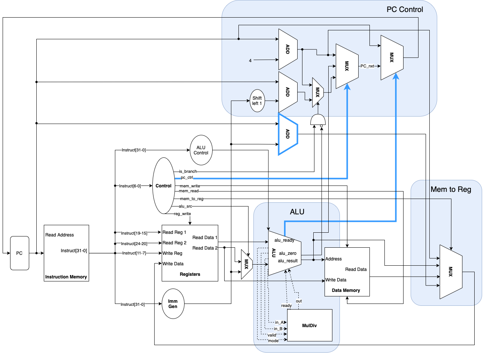

# Single Cycle RISC-V CPU
This project is an implementation of a single-cycle RISC-V CPU. Currently, it supports various instructions listed in the following table. To see more details of implementation, please refer to the [report](./report.pdf).

Type           | Instruction
--------------|:-----:
R    | ADD, SUB, SLL, SLT, SLTU, XOR, SRL, SRA, OR, AND, MUL
I    | ADDI, SLLI, SLTI, SLTIU, XORI, SRLI, SRAI, ORI, ANDI
I (JALR) | JALR
I (LW) | LW
S | SW
B | BEQ, BNE
U | AUIPC
UJ| JAL

